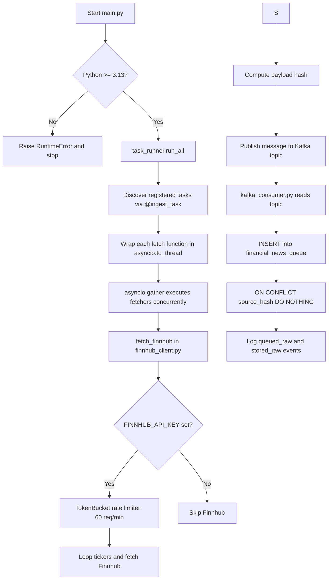
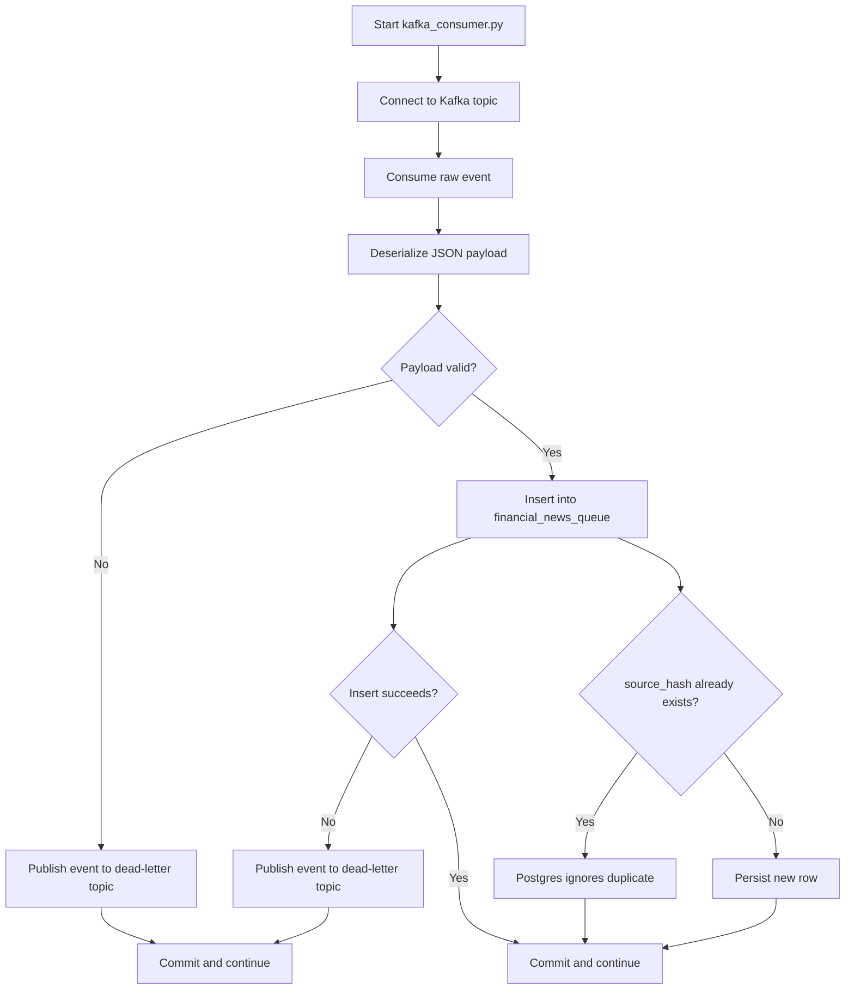
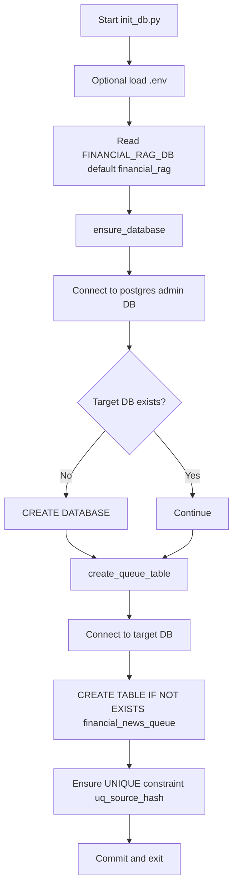

# GRAPH‑RAG Ingestion Module

A collection of tiny, single‑purpose Python scripts that fetch raw financial‑news
payloads, publish them to Kafka, and persist them into the PostgreSQL staging queue
(`financial_news_queue`) through a dedicated consumer.

## Quick start

```powershell
# 1️ Create a virtual environment (recommended)
python -m venv .venv
.\.venv\Scripts\activate

# 2 Install dependencies
pip install -r requirements.txt

# 3 Configure secrets (optional API keys for services that need them)
#    Copy `.env.example` → `.env` and fill in any keys:
#    FINNHUB_API_KEY.

# 4 Initialise the DB (run once)
python init_db.py

# 5 Start the Kafka consumer
python kafka_consumer.py

# 6 Run the orchestrator – it will call every `fetch_*` function automatically
python main.py
```

## Requirements

- Python 3.13 or greater

## Environment Variables

Start from `.env.example` and create your local `.env`.

Required

- `POSTGRES_URL`: PostgreSQL DSN used by ingestion writers.
- `KAFKA_BOOTSTRAP_SERVERS`: Kafka broker list for producers and consumer.
- `KAFKA_TOPIC`: Topic used for raw ingestion events.

Optional (shared)

- `HIST_START`: Historical window start timestamp in UTC (`%Y-%m-%d %H:%M:%S`).
- `HIST_END`: Historical window end timestamp in UTC (`%Y-%m-%d %H:%M:%S`).
- `FINNHUB_TICKERS`: Comma-separated tickers used by ticker-based jobs.
- `KAFKA_GROUP_ID`: Consumer group for `kafka_consumer.py`.
- `KAFKA_DLT_TOPIC`: Dead-letter topic for invalid/failed consumer messages.

Optional (API-based ingestion in `ingest/finnhub_client.py`)

- `FINNHUB_API_KEY`
- `FINNHUB_TICKERS`: Comma-separated tickers (e.g. `AAPL,MSFT,GOOGL`).

## API Contract Notes

`ingest/finnhub_client.py` is aligned to Finnhub docs for parameter names, date formats,
rate limiting (TokenBucket: 60 calls/min), and response shapes:

- Finnhub (`/company-news`)
	- Uses `symbol`, `from`, `to` with `YYYY-MM-DD` format.
	- Parses the documented top-level array response.

## Program Flow

### Runtime ingestion (`python main.py`)



### Kafka consumer (`python kafka_consumer.py`)



### Database setup (`python init_db.py`)

